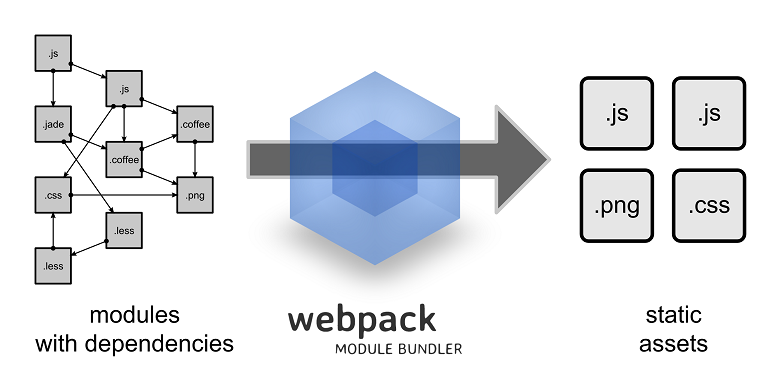
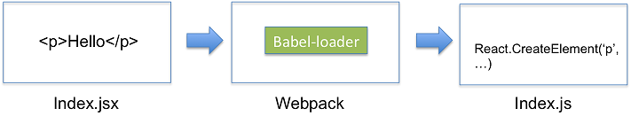
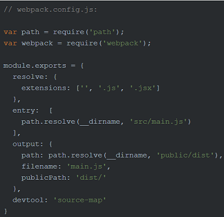

# Node-Package-Manager
##### Nikolai Kloß

---

# Agenda

1. Was ist React?
2. Motivation

---

# Webpack
##### Nikolai Kloß

---

# Agenda

1. Was ist Webpack?
2. Loader
3. Webpack-Dev-Server
4. Konfiguration

---

## 1. Was ist Webpack ?
- Ein "Bundler", der aus einer Reihe von Ressourcen wie z.B. mehreren
JavaScript-Dateien/Modulen, eine große statische JavaScript-Datei(Asset) erzeugt.

---

## 2. Loader
- Pflegt eine bündelbare Ressource(SASS,JS,PNG..) ins Asset ein.

- Jede Ressourcenart braucht individuellen Umgang.

- Deshalb: existieren viele Loader für viele Ressourcenarten.

- Lassen sich einfach via. require() oder config einbinden.

---

## 3. Webpack-Dev-Server

- Webpack stellt die Möglichkeit, einen einfache Webserver zum Testen der Anwendung
zu verwenden.

- "Hot"-Mode: Server erkennt Quellcode Änderungen automatisch und übersetzt die
neuen Teile des Systems. Somit wird ein Neuladen der Anwendung im Browser unnötig.

---

## 4. Konfiguration

- Die Konfiguration von Webpack wird in "webpack.config.js"definiert.
- "entry" und "output" legen den Pfad zur Einstiegsdatei fest und wohin
Webpack Artefakte schreiben soll.
- "resolve.extensions" definiert die Dateiendungen die Webpack zum bauen
einbeziehen soll.
- "devtool" veranlasst Webpack, "Source Maps" für das erzeugte Bundle-File zu
erzeugen. Dies vereinfacht das Debuggen des Systems.
