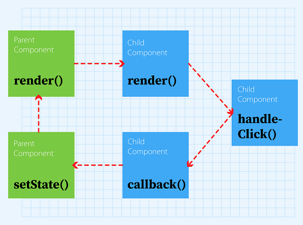
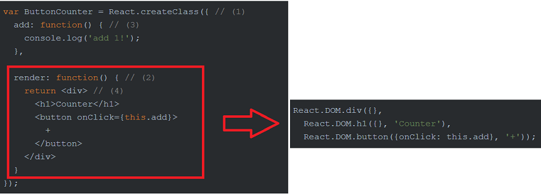
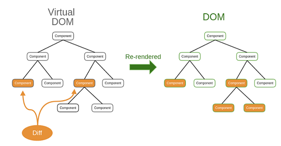

# ReactJS
##### Nikolai Kloß

---

# Agenda

1. Was ist React?
2. Motivation
3. Eine Bibliothek, kein Framework
4. Kompoentenarchitektur
5. JSX
6. State
7. Props
8. Virtual DOM

---

## 1. Was ist React?

Eine modulare Komponentenbasierte JavaScript-Bibliothek zur Erstellung von Benutzeroberflächen.
Entwickelt von Facebook, ist es trotz des neuartigen Ansatzes, aufgrund der hohen Renderingperformanz in der JS-Frontendentwicklung weit verbreitet und beliebt.

Es bildet typischerweise die Basis für Single-Page-Applications

---

## 2. Motivation

- Frontendcode verständlicher machen und die Wartbarkeit erhöhen.
- Facebook: Bugs wie unsychrone Nachrichtenzähler traten immer wieder auf und waren vorallem bei sehr komplexen Zusammenhängen ein großes undurchsichtiges Problem.

---

## 3. Eine Bibliothek, kein Framework

- Ein flexibles Werkzeug, welches erlaubt Anwendungen in der Sprache ihrer
eigenen Entwicklungsumgebung - und nicht in der Sprache des Frameworks - zu erstellen.
- Gibt keine Grundstruktur vor und lässt sich deshalb einfach in bestehende Codebasen integrieren.

---

## 4. Kompoentenarchitektur

- Zentraler und einziger Baustein von React sind Komponenten welche unteinander
kommunizieren.

---

## 4. Kompoentenarchitektur

- Folgt NICHT dem MV*-Modellen
- Logik für Interaktion und Darstellung werden innerhalb eines einzigen Objekts gebündelt
- Bedeutet: Jeder Code der zu einer Komponente gehört,
wird in eine Datei geschrieben - egal ob HTML, Javascript oder CSS.

---

## 5. JSX

- Javascript-Syntax-Extension erlaubt das einpflegen
von HTML.

- JSX wandelt HTML in ausführbaren JS-Code um.

---

## 6. State

- State: ein Attribut welches Daten der jeweiligen Komponente enthält.
- Es kann nur von der Komponente selbst direkt verwaltet werden.
- "getInitialState" wird einmalig bei Erzeugung der Komponenteninstanz aufgerufen.
- "this.setState()" definiert einen Setter für die State-Attribute einer Komponente und löst nach einer Änderung die "render" Funktion aus.

## 7. Props
- Props werden von außen (anderen Komponenten) an Komponente übergeben und sind aus der Sicht der Empfänger-Komponenten-Seite schreibgeschützt.
- Die Unterscheidung von unveränderlichen Props und den veränderlichem State ermöglicht es leichter das Verhalten des Systems nachzuvollziehen.
- Weil: fehlerhafte Änderungen können nur durch Stateänderungen zustande kommen und nie durch Props.

---

## 8. Virtual DOM

- Prinzipiell verfolgt React das Ziel das Document-Object-Model bei Änderung der Daten neu zu Rendern.
- Den kompletten DOM neu zu erzeugen ist sehr Ressourcenlastig
- Daher: Änderungen werden in einen virtuellen DOM eingepflegt.
- Durch den Vergleich zwischen virtuellen und tatsächlichen DOM ergibt sich eine Differenzmenge, welche React aufzeigt, an welchen bestimmten Stellen der DOM neu gerendert werden muss.
